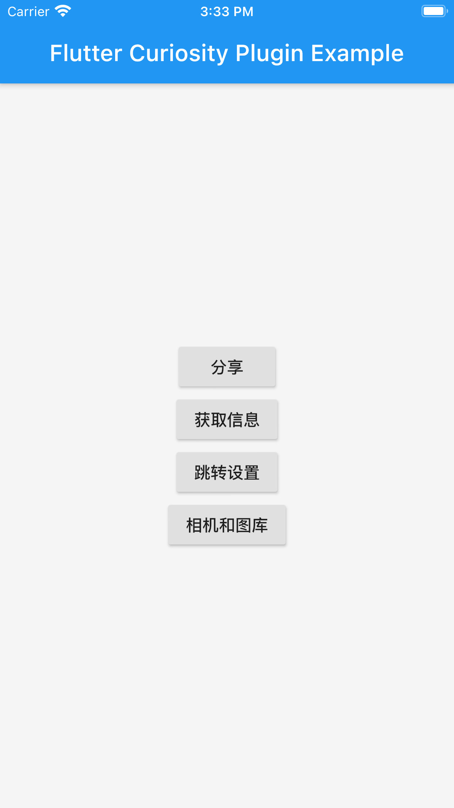
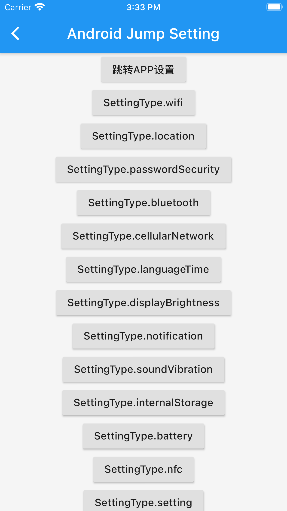
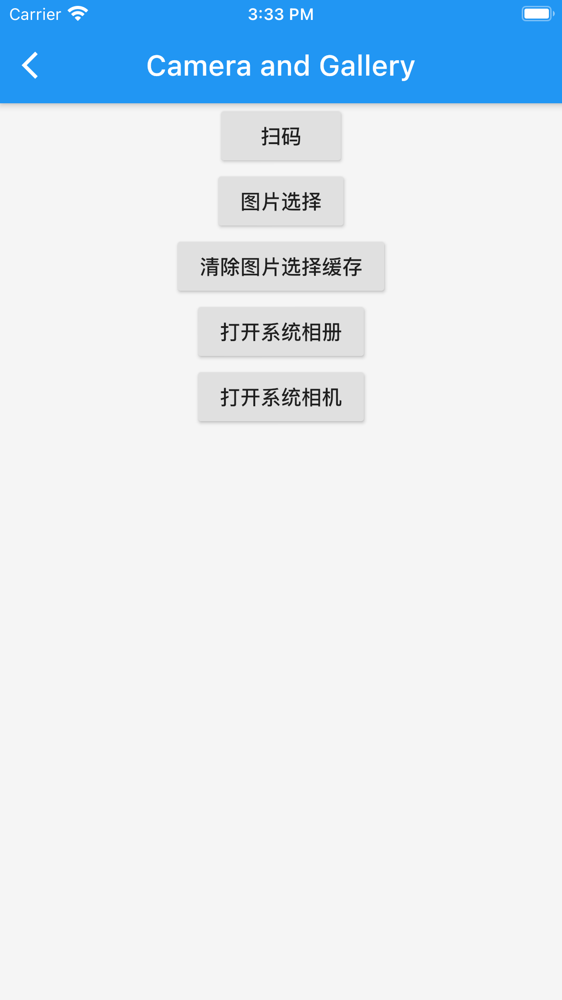

# flutter_curiosity
集成部分原生功能，支持ios android

## android按需添加权限
 * android/app/src/main/AndroidManifest.xml 添加权限
```
    <!--允许程序使用相机-->
    <uses-permission android:name="android.permission.CAMERA" />
    <!--允许程序写入本地存储-->
    <uses-permission android:name="android.permission.WRITE_EXTERNAL_STORAGE" />
    <!--允许程序读取本地存储-->
    <uses-permission android:name="android.permission.READ_EXTERNAL_STORAGE" />
    <!--允许程序打开闪光灯-->
    <uses-permission android:name="android.permission.FLASHLIGHT" />
    <!--允许程序打开网络-->
    <uses-permission android:name="android.permission.INTERNET" />
    <!--允许程序访问有关GSM网络信息-->
    <uses-permission android:name="android.permission.ACCESS_NETWORK_STATE" />
    <!--允许程序防止休眠-->
    <uses-permission android:name="android.permission.WAKE_LOCK" />
    <!--允许程序拨打电话-->
    <uses-permission android:name="android.permission.CALL_PHONE" />
    <!--允许程序安装应用程序-->
    <uses-permission android:name="android.permission.REQUEST_INSTALL_PACKAGES" />
```
## ios按需添加权限
 * ios/Runner/Info.plist 添加权限
 
```
    <key>NSCameraUsageDescription</key>    
    <string>请允许打开相机拍照</string>
    <key>NSLocationWhenInUseUsageDescription</key>
	<string>通过您的地理位置信息获取您周边的相关数据</string>
	<key>NSPhotoLibraryAddUsageDescription</key>
	<string>请允许访问相册以选取照片</string>
	<key>NSPhotoLibraryUsageDescription</key>
	<string>请允许访问相册以选取照片</string>
	<key>NSFileProviderDomainUsageDescription</key>
	<string>是否允许此App使用你的相机进行拍照？</string>
    <key>io.flutter.embedded_views_preview</key>
    <true/>
```

## 1.[原生方法](./lib/src/tools/native.dart)

## 2.[二维码扫描](./lib/src/scanner)

##### 中文适配：  
- 添加中文 Runner -> Info.plist -> Localizations 点击"+"按钮，选择Chinese(Simplified)

## 3.获取手机硬件信息 (app信息,设备信息)






<style>
img[alt="main",alt="share",alt="android_setting",alt="app_device",alt="camera_gallry",]{
  width:100px;
}
</style>